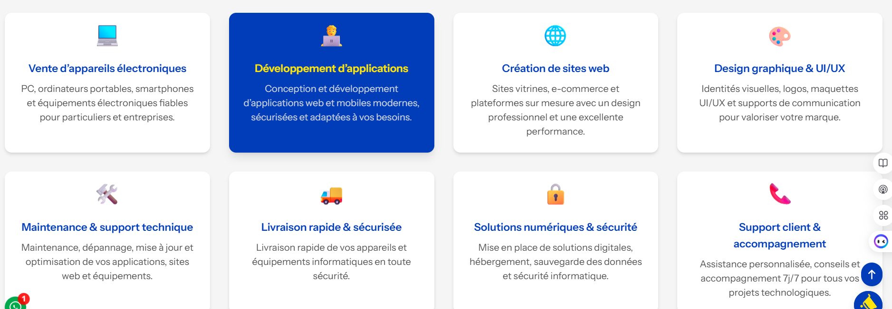
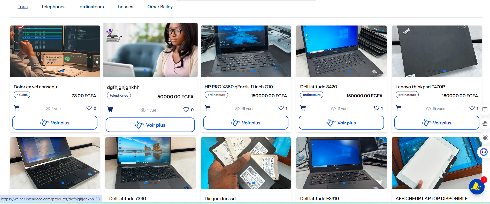
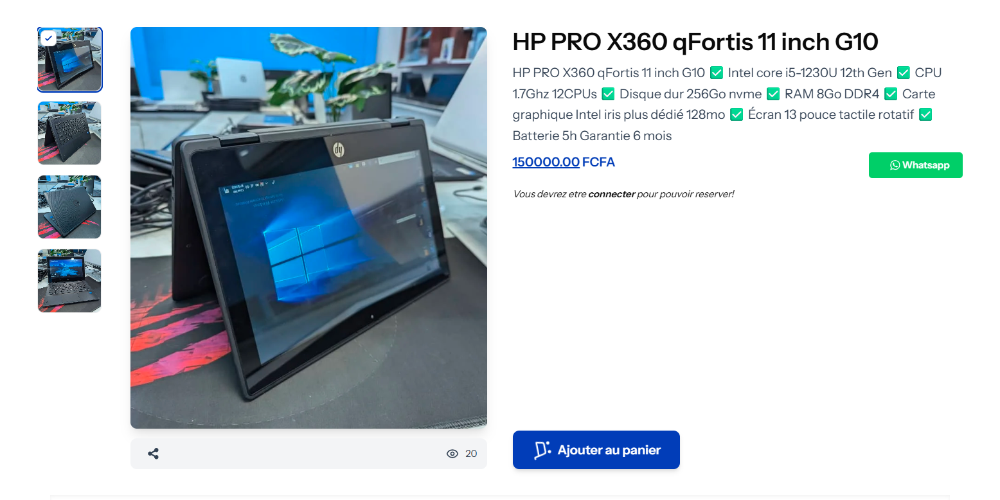
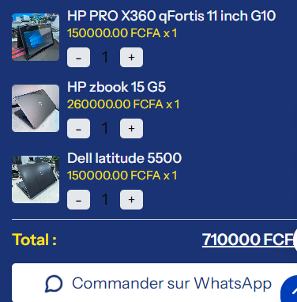

# Boris Tech

[](https://laravel.com)
[](https://php.net)
[](https://nodejs.org)
[](LICENSE)

## Description

Boris Tech est une plateforme e-commerce moderne développée avec Laravel, offrant une expérience utilisateur fluide grâce à Inertia.js et une interface réactive avec Tailwind CSS. Le projet inclut des fonctionnalités avancées telles que la gestion des utilisateurs, des produits, des commandes, et bien plus.

## Fonctionnalités

- **Gestion des utilisateurs** : Authentification, profils, et sécurité avec Laravel Fortify.
- **Catalogue de produits** : Catégories, produits, images, et descriptions détaillées.
- **Système de commandes** : Suivi des commandes et notifications.
- **Blog et commentaires** : Articles de blog avec système de commentaires.
- **Newsletter** : Inscription et gestion des abonnements.
- **SEO optimisé** : Traits pour l'optimisation SEO.
- **Interface moderne** : Utilisation d'Inertia.js pour une SPA-like experience.

## Technologies utilisées

- **Backend** : Laravel 12, PHP 8.2+
- **Frontend** : Inertia.js, Vue.js, Tailwind CSS
- **Base de données** : MySQL /
- **Outils de build** : Vite, NPM
- **Tests** : PHPUnit
- **Autres** : Composer, ESLint

## Installation

### Prérequis

- PHP 8.2 ou supérieur
- Composer
- Node.js 18+ et NPM
- MySQL ou PostgreSQL

### Étapes d'installation

1. **Cloner le repository** :
   ```bash
   git clone https://github.com/boris2442/boris_tech
   cd boris_tech
   ```

2. **Installer les dépendances PHP** :
   ```bash
   composer install
   ```

3. **Installer les dépendances JavaScript** :
   ```bash
   npm install
   ```

4. **Configurer l'environnement** :
   - Copier le fichier `.env.example` vers `.env` :
     ```bash
     cp .env.example .env
     ```
   - Modifier les variables d'environnement dans `.env` (base de données, clés d'API, etc.).

5. **Générer la clé d'application** :
   ```bash
   php artisan key:generate
   ```

6. **Exécuter les migrations** :
   ```bash
   php artisan migrate
   ```

7. **Exécuter les seeders (optionnel)** :
   ```bash
   php artisan db:seed
   ```

8. **Construire les assets** :
   ```bash
   npm run build
   ```

9. **Démarrer le serveur** :
   ```bash
   php artisan serve
   ```

10. **Démarrer Vite pour le développement frontend** :
    ```bash
    npm run dev
    ```

L'application sera accessible sur `http://localhost:8000`.

## Utilisation

- Accédez à l'application via votre navigateur.
- Inscrivez-vous ou connectez-vous pour accéder aux fonctionnalités utilisateur.
- Naviguez dans le catalogue de produits, ajoutez des articles au panier, et passez des commandes.
- Gérez votre profil, consultez vos commandes, et interagissez avec le blog.

## Captures d'écran

Voici quelques captures d'écran de l'application :

### Page d'accueil


### Catalogue de produits


### Détails du produit


### Panier et commandes


*Remarque : Remplacez les chemins d'images par vos propres captures d'écran une fois prises.*

## Tests

Pour exécuter les tests :
```bash
php artisan test
```

## Contribution

Les contributions sont les bienvenues ! Veuillez suivre ces étapes :

1. Fork le projet.
2. Créer une branche pour votre fonctionnalité (`git checkout -b feature/AmazingFeature`).
3. Commit vos changements (`git commit -m 'Add some AmazingFeature'`).
4. Push vers la branche (`git push origin feature/AmazingFeature`).
5. Ouvrir une Pull Request.

## Licence

Ce projet est sous licence MIT. Voir le fichier [LICENSE](LICENSE) pour plus de détails.

## Contact

Pour toute question ou suggestion, contactez-nous à [contact@walnertech.com](mailto:contact@walnertech.com).

---

Développé avec ❤️ par l'équipe Boris Tech.
